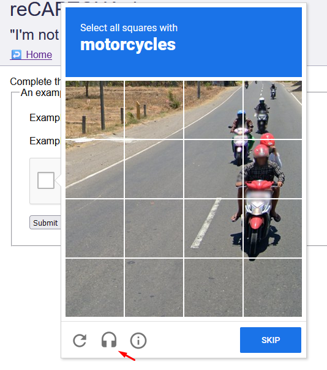

# Welcome to CaptchaSolver!
<p></p>

Simple reCAPTCHA Solver with Python using accessibility sound option at Recaptcha. Created using Playwright.

## Requirements
Python >= 3.11  
[FFmpeg](https://github.com/BtbN/FFmpeg-Builds/releases)

## Installation

- Install Dependecies

```bash
$ pip install -r requirements.txt
```

- Install Playwright

```bash
$ playwright install
```

- Intall FFmpeg (extractor texto from audio)

[Install here](https://github.com/BtbN/FFmpeg-Builds/releases)

In case to have trouble in installation, you can follow the steps in this [tutorial](https://blog.gregzaal.com/how-to-install-ffmpeg-on-windows/)

## Usage example

```python
from captcha_solver import capcha_solver

def your_page_funcion(page):
    element_handle = await page.wait_for_selector('iframe[title="reCAPTCHA"]')
    captcha = await element_handle.content_frame()
    captcha_checkbox = await captcha.wait_for_selector('.recaptcha-checkbox-border')
    await captcha_checkbox.click()
    await capcha_solver(page)
```

## How it works

1. Change solve type to accessibility



2. Listen the audio and extract the text


3. Write the extracted text into result


4. Solve the captcha


## Social medias
* [Instagram](https://www.instagram.com/claudiogfez/)
* [Linkedin](https://www.linkedin.com/in/clcostaff/)

# Author
| [<br><sub>@clcostaf</sub>](https://github.com/clcosta) |
| :---: |
